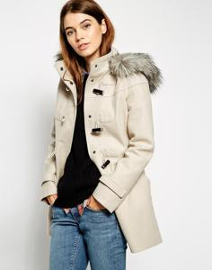
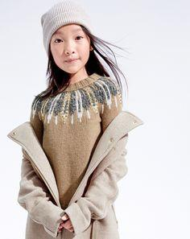
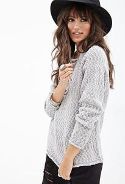
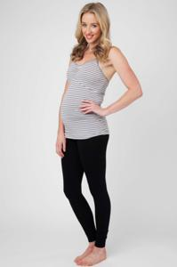
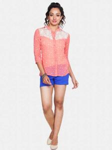
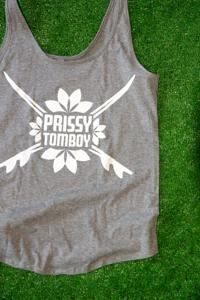
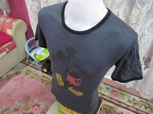
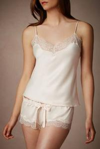
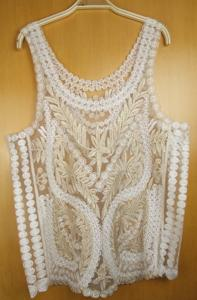

# Cloth Recommendation System

Convolutional Neural Network for recommending cloths


### Creating a custom model to train still remaining due to lack of resources for now

## Output from a VGG19 (pre-trained)

### Input image

 <br>

### Returned similar images

 <br>
 <br>
 <br>

### Input image

 <br>

### Returned similar images

 <br>
 <br>
 <br>

### Input image

 <br>

### Returned similar images

 <br>
 <br>
 <br>

## Install the dependencies.

```bash
$ pip install -r requirements.txt
```

## Augment images
```bash
$ python augment_images.py
```

## To train the model.
```bash
$ python train.py
```

## For tensorboard vizualization while training.
```bash
$ tensorboard --logdir=tensorboard_logs --host=localhost --port=8088
```

## Note:

Different model require different size if images. This can be edited in the `tf_records.py` in resize opereation.
